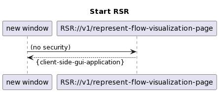
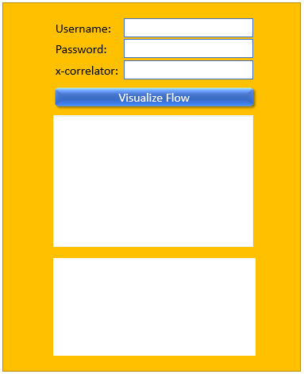
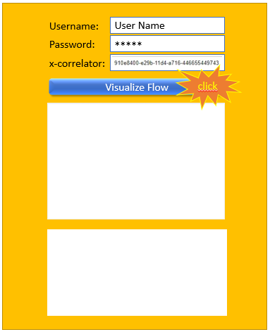
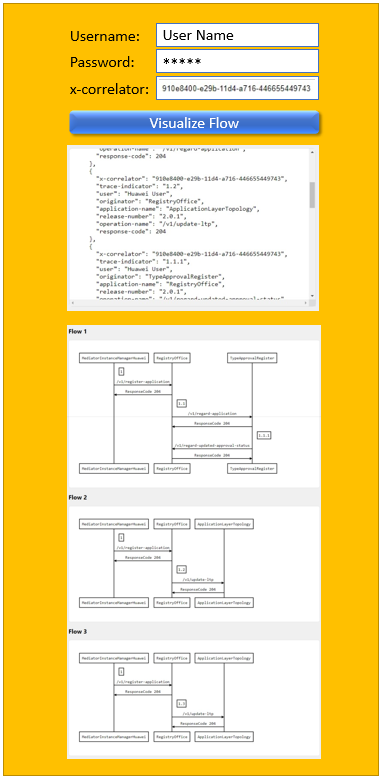

# RequestSequenceRepresentation Specification

When RSR://v1/represent-flow-visualization-page gets called in a browser window  
  
the client side code module for representing the GUI gets downloaded to the browser.  
This shall result in representation of the empty GUI.  
  

.  

User needs to fill in username, password and x-correlator of the flow to be visualized.  
  

.  

Clicking the Visualize Flow button shall make the client side GUI module to send a request to "RSR://v1/update-flow-visualization-page" at the server side  
  
After authenticating the requestor at AdministratorAdministration and retrieving the required data from ExecutionAndTraceLog, the server side is responding the data that is to be filled into the GUI, which is represented by the client side module.  
  

.  

The RequestSequenceRepresentation application shall also support being started in generic representation.  
  

.  

### ServiceList
- [RequestSequenceRepresentation+services](./RequestSequenceRepresentation+services.yaml)

### ProfileList and ProfileInstanceList
- [RequestSequenceRepresentation+profiles](./RequestSequenceRepresentation+profiles.yaml)
- [RequestSequenceRepresentation+profileInstances](./RequestSequenceRepresentation+profileInstances.yaml)

### ForwardingList
- [RequestSequenceRepresentation+forwardings](./RequestSequenceRepresentation+forwardings.yaml)

### Open API specification (Swagger)
- [RequestSequenceRepresentation](./RequestSequenceRepresentation.yaml)

### CONFIGfile (JSON)
- [RequestSequenceRepresentation+config](./RequestSequenceRepresentation+config.json)

### Comments
./.
